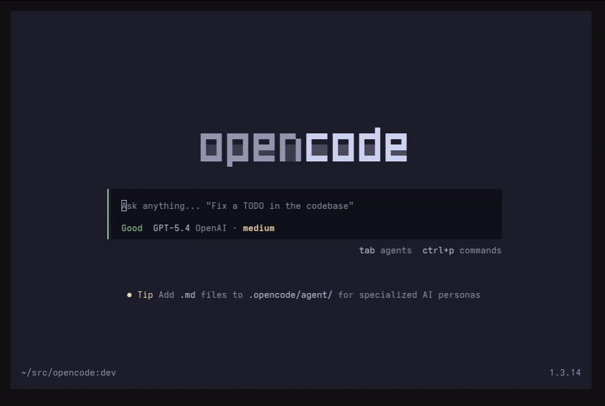

# esuyo-opencode-tks

Displays live TPS (tokens per second), average TPS, average TTFT (time to first
token), and **GAP** (time between the end of the previous assistant response and
the start of the next one) in the OpenCode session prompt. Optionally appends
per-message stats as JSONL for later analysis.

```
TPS 62.4 | AVG 58.1 | TTFT 0.9s | GAP 12.3s
```



## Installation

Install from the CLI:

```bash
opencode plugin @esuyo/esuyo-opencode-tks@latest --global
```

Requires `opencode` `1.3.14` or newer.

If you previously installed the upstream `oc-tps`, uninstall it first so both
plugins do not register the same slot:

```bash
opencode plugin oc-tps --global --uninstall
```

## Metrics

| Metric | Meaning |
| --- | --- |
| `TPS` | Live tokens/sec over the last 5s streaming window. |
| `AVG` | Session-average tokens/sec across completed assistant messages. |
| `TTFT` | Session-average time from request start to first token. |
| `GAP` | Time between the previous final assistant completion and this message's start, including user think-time. Shows `-` for the first message. |

GAP is measured between **final** completions only; intermediate
`finish: "tool-calls"` chunks do not reset the baseline.

## File logging

Every completed assistant message is appended as one JSON object per line
(JSONL). No prompt or response text is ever written — numeric metadata only.

Default path:

```
~/.local/share/opencode/esuyo-opencode-tks.log
```

Override with an environment variable:

```bash
export ESUYO_TPS_LOG=/path/to/tps.log
```

Disable logging by pointing it at `/dev/null`:

```bash
export ESUYO_TPS_LOG=/dev/null
```

### Schema (v1)

```jsonc
{
  "v": 1,
  "at": "2026-09-11T23:50:00.000Z",   // completion wall-time
  "sessionID": "ses_...",
  "messageID": "msg_...",
  "finish": "stop",                    // "stop" | "tool-calls" | ...
  "tokensOutput": 123,
  "tokensReasoning": 45,
  "tokensTotal": 168,
  "durationMs": 2345,                  // first response -> end
  "ttftMs": 456,                       // request start -> first response
  "gapMs": 12340,                      // previous completion -> this start (null on first)
  "avgTps": 71.6,
  "liveSamplesDropped": false
}
```

Log writing is best-effort: I/O errors are swallowed so the TUI never crashes.

### Rotation

v1 does not rotate the log. Use `logrotate`, for example:

```
/root/.local/share/opencode/esuyo-opencode-tks.log {
    weekly
    rotate 4
    compress
    missingok
    notifempty
    copytruncate
}
```

## Development

```bash
npm install
npm run typecheck
npm test
```

Credits & license
-----------------

Forked from [`Tarquinen/oc-tps`](https://github.com/Tarquinen/oc-tps) at commit
`89bf5b8` (v0.0.10). The upstream project declared no license; original work
remains attributed to its author. See [NOTICE](./NOTICE) and [LICENSE](./LICENSE)
(MIT).

---
